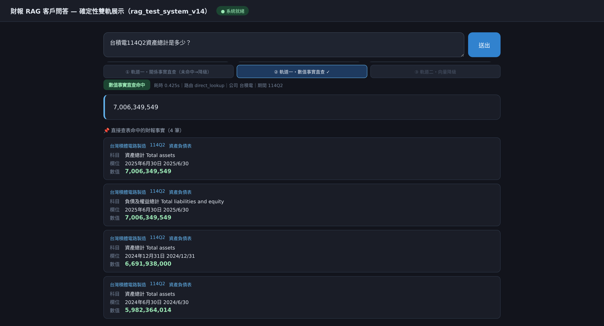
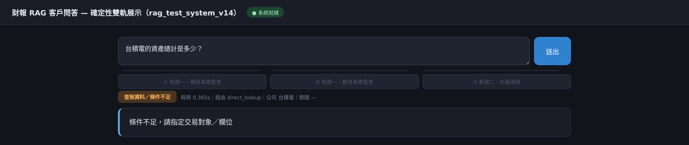
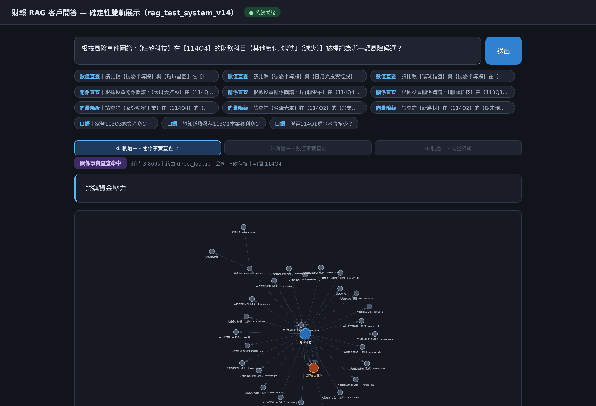

# 繁中財報 RAG：確定性雙軌檢索系統

**Deterministic Dual-Track RAG for Traditional-Chinese Financial Report QA — Taiwan Semiconductor Industry**

> 碩士論文實作｜國立臺灣師範大學 AI 跨域應用研究所｜作者：余品誼｜指導教授：林政宏 博士
> 論文題目：基於自適應路由與結構化查詢之繁體中文財報檢索增強生成系統：以台灣半導體產業為例

傳統向量 RAG 在財報數值問答上「**撈得到，答不對**」：檢索命中率 Hit@1 97.7%，精確匹配率 EM 卻只有 12%。
本專案把「該讀表格的哪一格」從語言模型的閱讀理解，改成程式的集合過濾——
小模型（Qwen3-4B-AWQ）只負責讀懂問題，數值與關係由預編譯的事實表**確定性取出**；
候選不唯一時**拒答而不編造**。

<p align="center"></p>

---

## 成果

| 評測 | 結果 |
|---|---|
| 架構測試 100 題：傳統 RAG → 結構扁平化 → 確定性修復層 → 去歧義金標 | EM **12% → 76% → 90% → 100%** |
| 檢索策略消融 60 題（純 SLM／純向量／純關係／關係＋向量並行／**路由分流**） | 1.7%／6.7%／21.7%／20.0%／**78.3%** |
| 證據格式受控消融 190 題（原始 Markdown／扁平化 K-V／**Fact 直查**） | 15.3%／21.1%／**94.2%** |
| 純口語 100 題（「台積電114Q2營收多少？」零提示） | EM 59% → **100%** |
| 衍生比率 50 題：SLM 算術 vs 前沿模型算術 vs **Python 代數** | 58% vs 90% vs **100%**（快 4,036,876 倍） |
| **預註冊 held-out**（先凍結題庫與預測，再量測；5 組共 360 題） | 92%–100%，全數高於凍結前預測 |
| 27B 純向量 RAG（移除全部規則）vs 4B＋路由過濾，同 130 題 | 13.1% vs **20.8%**（McNemar p=0.041） |
| 2×2 因子消融：模型規模 vs 結構化過濾 | 規模 +1.5 pp（不顯著）；過濾 **+15.4 pp**（p=3.6×10⁻⁵） |

<p align="center">


</p>

> 消融圖的標籤沿用開發期名稱：純 LLM＝純 SLM、純圖譜＝純關係直查、混合路由＝路由分流。

## 系統畫面

| 數值事實直查（唯一命中，0.4 秒） | 條件不足時拒答並指出缺什麼 |
|---|---|
|  |  |

<p align="center"><br>
<sub>關係事實直查：答案（橘色節點）與以問句公司為錨點的 1–2 hop 子圖</sub></p>

---

## 核心設計

1. **確定性雙軌**
   - 軌道一 `direct_lookup`：數值事實（211,263 筆）與關係事實（四大圖譜 32,039 節點／125,167 邊預編譯為查表），pandas 鍵值匹配，**答案不經模型生成**。
   - 軌道二 `semantic_rag`：ChromaDB（30,887 chunks）＋ metadata 硬過濾，僅在查表未命中時降級使用。
   - 880 題凍結評測中 95.7% 由軌道一作答。
2. **唯一性閘門**：公司、期別、表格、科目、欄位過濾後相異值恰為 1 才作答；多值拒答並回傳缺少的條件，空值才降級。
3. **確定性修復層 Fix 1–20**：依管線階段分為五群——槽位補全、體系對映（口語 → 申報科目）、候選收斂、唯一性閘門、組裝與降級。
4. **口語—申報體系橋接**：市場簡稱別名（台積電 → 台灣積體電路製造）、科目本體論（「欠多少錢」→ 負債總計）、原句線索覆蓋小模型的錯誤意譯。
5. **領域知識外部化**：公司別名、本體論、比率公式、路由關鍵字全在 `system/config/system_config.json`（224 條目）。換產業不改程式；以跨產業三家公司四臂對照驗證。
6. **Prompt 契約層**：Router 採 JSON Schema 強制解碼＋ Pydantic 驗證；Python 主導最終路由；具 prompt injection 資料邊界。

## 評測方法（這個專案花最多力氣的地方）

- **預註冊 held-out**：以固定種子產生與開發集同分布、實例互斥的孿生題庫，連同預測值 SHA256 凍結後才量測。凍結後的任何修改都公開登錄為修訂（A1–A4、B1–B6、C1–C3）。見 [`docs/HELDOUT_PREREGISTRATION.md`](docs/HELDOUT_PREREGISTRATION.md)。
- **金標機械化稽核**：11 類判準反查事實表，修正 136 題金標；以「原始／修資料集／修資料集＋修程式」三欄重測，分離資料與程式各自的貢獻。
- **否證條件**：論文的每項發現都預先寫明「什麼結果會推翻它」，並實際跑了 27B 模型、bge-m3、BM25、封住軌道一等四條路徑去嘗試推翻。
- **誠實揭露限制**：線上多跳圖推理實測 0/30（已下架，圖譜定位改為離線 ETL）；嵌入模型確實有未探索的改善空間；題庫皆為自建。

完整技術報告：**[REPORT.md](REPORT.md)**｜28 項實驗總目錄：[docs/EXPERIMENTS.md](docs/EXPERIMENTS.md)

---

## Repo 結構

```
├── REPORT.md               技術報告
├── docs/
│   ├── EXPERIMENTS.md      實驗總目錄（目的、腳本、題庫、結果）
│   ├── REPRODUCE.md        環境與重跑指令
│   ├── CODE_MAP.md         每支程式的用途
│   ├── HELDOUT_PREREGISTRATION.md
│   ├── BASELINE_PURE_RAG_27B.md
│   ├── results/            各實驗之 Markdown 報表（28 份）
│   └── images/
├── system/                 ★ 主系統（可執行）
│   ├── rag_test_system_v14.py   問答引擎：路由、雙軌檢索、Fix 1–20、評分器（CLI）
│   ├── rag_api.py               RAGSystem 統一 API
│   ├── llm_contract.py          Prompt 契約層
│   ├── config/                  領域知識設定
│   ├── questions/               題庫（含 3 份預註冊 held-out）與生成器
│   ├── tests/                   113 項單元測試
│   ├── rag_frontend/            問答前端（Flask）
│   ├── neo4j_graph_demo/        圖譜渲染效能對照前端
│   └── *.py / *.sh              資料管線、held-out 流程、消融、稽核、插圖
├── baseline_pure_rag/      27B 純向量 RAG 對照與檢索端否證實驗
└── legacy_v12/             前期 v12 系統：基底模型選型（FinQA）與 60 題檢索消融
```

## 快速開始

```bash
conda create -n finrag python=3.10 && conda activate finrag
pip install -r requirements.txt

# LLM 服務（意圖路由）
vllm serve Qwen/Qwen3-4B-AWQ --gpu-memory-utilization 0.85 --max-model-len 4096 --port 8000

cd system
python3 -m pytest -q tests                       # 單元測試（需先備妥資料，見下）
python3 rag_api.py "台積電114Q2營收多少？"
cd rag_frontend && python3 app.py                # http://localhost:5002
```

**資料不在 repo 內**（約 3 GB，公開資訊觀測站 MOPS 之公開財報）。以 `system/` 內的管線重建：

```bash
python3 html_downloadv2.py                        # 下載財報 HTML（讀 companies.txt，一行一個股票代號）
python3 deal_html_datav2_strip_company_suffix.py  # 解析為寬表與 Fact 索引
python3 build_all_graphs_merged_all_targets.py    # 四大關係圖譜
python3 rag_test_system_v14.py build-index        # 向量索引
```

研究樣本為 30 家台灣半導體公司 × 113Q1–114Q4 共 8 期。詳見 [docs/REPRODUCE.md](docs/REPRODUCE.md)。

## 技術棧

Python 3.10 · vLLM（Qwen3-4B-AWQ）· Ollama（Qwen3.8-27B GGUF）· ChromaDB · sentence-transformers（bge-small-zh-v1.5／bge-m3）· pandas · Pydantic · Flask · vis.js · Neo4j · Playwright · pytest

---

### English summary

A master's-thesis RAG system for numeric and relational QA over Taiwan-listed semiconductor companies' financial reports (MOPS HTML/iXBRL, 30 companies × 8 quarters). Plain vector RAG retrieves the right table (Hit@1 97.7%) but copies the wrong cell (EM 12%). This system confines the LLM (Qwen3-4B-AWQ) to intent routing. Answers come out of pre-compiled fact tables through deterministic key matching with a uniqueness gate: the system answers only when exactly one value remains and refuses otherwise. Vector RAG is used only as a fallback. Results:

- Architecture test: EM 12% → 100%
- Colloquial questions: EM 59% → 100%
- Pre-registered held-out sets (360 questions): 92–100%

Falsification experiments show that neither a 27B model nor better retrievers (bge-m3, BM25) close the gap (best 36.1% vs 94.2% for deterministic lookup). A 2×2 factorial design attributes the gain to structured filtering (+15 pp, p<10⁻⁴), not model scale (+1.5 pp, n.s.).
