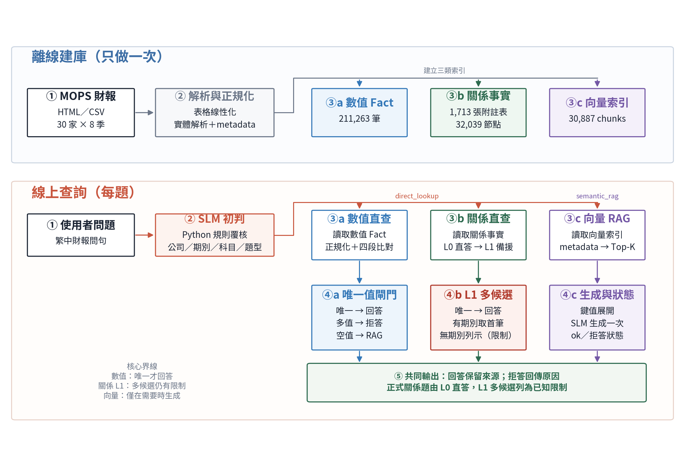
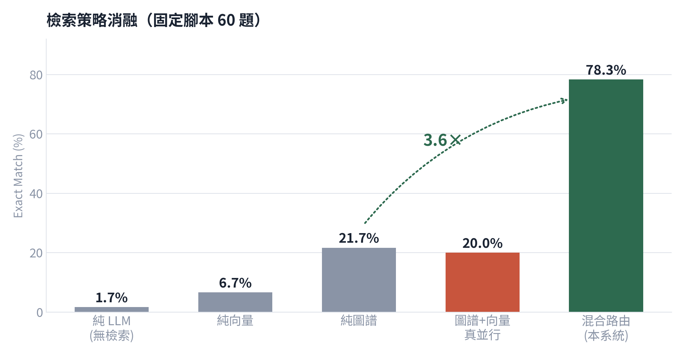
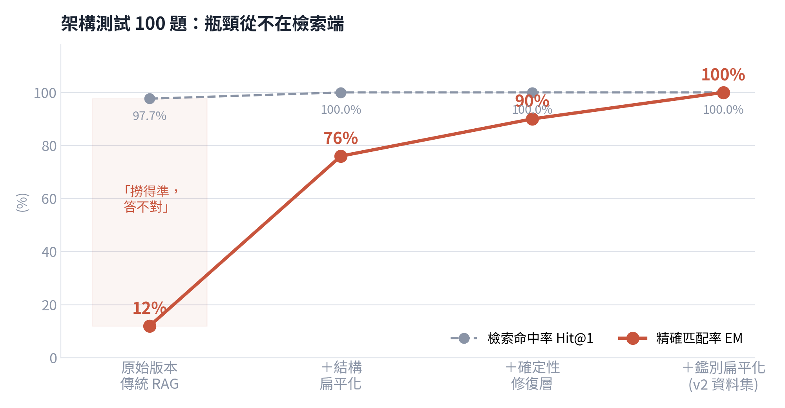
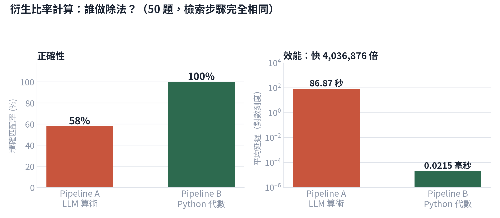

# 技術報告：繁中財報問答的確定性雙軌 RAG

> 本報告為碩士論文〈基於自適應路由與結構化查詢之繁體中文財報檢索增強生成系統：以台灣半導體產業為例〉之精簡技術版。
> 數字皆取自論文表格，對應的實驗編號（E01–E28）見 [docs/EXPERIMENTS.md](docs/EXPERIMENTS.md)。

## 目錄

1. [問題：為什麼傳統 RAG 答不對財報數字](#1-問題為什麼傳統-rag-答不對財報數字)
2. [資料](#2-資料)
3. [系統架構](#3-系統架構)
4. [關鍵技術](#4-關鍵技術)
5. [評測方法](#5-評測方法)
6. [實驗結果](#6-實驗結果)
7. [研究發現與否證](#7-研究發現與否證)
8. [限制](#8-限制)
9. [開發歷程中的關鍵轉折](#9-開發歷程中的關鍵轉折)

---

## 1. 問題：為什麼傳統 RAG 答不對財報數字

在 100 題架構測試上，傳統向量 RAG 的 **Hit@1 為 97.65%，EM 卻只有 12%**。檢索端幾乎總是撈到正確的表，但模型答錯。失效可分三類：

| 失效機制 | 例子 |
|---|---|
| **錯欄**：季報同時並列本期與去年同期兩個年份欄，模型讀到另一欄 | 台灣光罩 114Q2，答成 113Q2 的數字 |
| **錯列／錯對象**：同一科目在不同交易對象或附註表重複出現 | 穩懋 114Q2 關係人交易，抄到別的交易對象的金額 |
| **格式與生成**：輸出夾帶冗詞、單位，括號負數翻正 | 營業利益率真值 −6.06%，模型答 6.05% |

根因是**二維表格的「欄」與「列」是離散鍵，語意向量分不開「期別」與「表名」這兩個維度**；而財報數值的位置恰恰由它們決定。
在沒有 metadata 過濾的全庫檢索下，金標來源進 Top-5 的比率（Recall@5）只有 20.0%（E23）。

## 2. 資料

- **來源**：公開資訊觀測站（MOPS）財報 HTML／iXBRL（前期曾嘗試掃描 PDF 的版面解析與多來源對帳，因表格重建無法稽核而放棄）
- **樣本**：30 家台灣半導體產業公司（依櫃買中心產業鏈平台篩選）× 113Q1–114Q4 共 8 期
- **離線建庫**：

| 產物 | 規模 | 程式 |
|---|---|---|
| 數值 Fact 長表（股票代號、公司、期別、表名、科目、欄位標頭、數值） | 211,263 筆 | `deal_html_datav2_strip_company_suffix.py` |
| 四大關係圖譜（投資、關係人交易、產業鏈、風險事件） | 32,039 節點／125,167 邊 | `build_all_graphs_merged_all_targets.py` |
| 向量索引（bge-small-zh-v1.5，ChromaDB） | 30,887 chunks | `rag_test_system_v14.py build-index` |

## 3. 系統架構

**線上流程（每題）**

1. **SLM 意圖路由**：Qwen3-4B-AWQ 以 JSON Schema 強制解碼輸出槽位（公司、期別、科目、表名、欄位、題型），Pydantic 驗證；Python 規則覆核並決定最終路由。
2. **槽位補全與正規化**：由原句 regex 補回小模型遺失或截斷的槽位，並做口語對映（Fix 群一、二）。
3. **軌道一 `direct_lookup`**
   - 數值分支：對 Fact 表以公司、期別、表名、科目、欄位做集合過濾。
   - 關係分支：L0 樣板直答（預編譯關係事實表）。
4. **唯一性閘門**：唯一 → 回答；多值 → 拒答並指出缺少的條件；空值 → 降級到軌道二。
5. **軌道二 `semantic_rag`**：metadata 硬過濾＋ Top-K 向量檢索，SLM 生成一次，輸出 `ok` 或拒答狀態。

**架構的分界**畫在「答案由程式取出 vs 由模型生成」，而不是「資料是不是圖」。開發中期曾有第三軌「線上圖遍歷（GraphRAG）」，實測後下架（§7 F4）。

## 4. 關鍵技術

### 4.1 結構扁平化

- **表格線性化**：二維表攤平為 `(科目, 欄位標頭, 數值)` 鍵值列。
- **圖譜路徑扁平化**：多跳關係預先編譯成單一查表列。
- **鑑別扁平化**：在題幹與鍵中加入消歧子句（所在地、主要業務、交易對象）。

架構測試因此由 EM 12% 升到 76%。受控消融（§6.2）進一步證明：扁平化真正起決定作用的是**離線建索引**，不是線上把表格換個排版給模型讀。

### 4.2 確定性修復層 Fix 1–20

依管線階段分為五個修復群（`system/fix_groups.py` 為命名的單一事實來源）：

| 修復群 | 作用 | Fix | 代表性修復 |
|---|---|---|---|
| 一、槽位補全 | 補回小模型遺失的槽位 | 1、5、6、13、14、17、18 | Fix 1：由題幹括號抽出欄位標頭（col_hint）並還原科目全名 |
| 二、體系對映 | 使用者語言 → 申報體系的鍵 | 12、13 | Fix 12：市場簡稱別名；Fix 13：原句同義詞最長匹配，覆蓋 Router 的錯誤意譯 |
| 三、候選收斂 | 縮小候選到可判定唯一 | 2、7、8、9、11、16 | Fix 16：關係人交易以（交易人、交易對象、科目）三元語意主鍵取代無語意列序號 |
| 四、唯一性閘門 | 決定可否作答 | 20 | Fix 20：未指定期別的單值題採最新期別並在答案內揭露假設；比較題不套用 |
| 五、組裝與降級 | 程式組裝或安全降級 | 3、4、10、14、15、19 | Fix 14：比率由 Python 做除法；Fix 19：題幹要求「全部列出」時全列並列 |

每條修復都可用環境變數（如 `DISABLE_FIX16=1`）關閉，用於消融重測。

### 4.3 口語—申報體系橋接

使用者說「台積電欠了多少錢」，申報體系寫的是「台灣積體電路製造股份有限公司／負債總計」。中間有三層落差，逐層修復的 EM 增益（純口語 100 題）：

| 落差 | 技術 | EM |
|---|---|---|
| 基線 | — | 59% |
| 公司簡稱 | 28 個市場別名，**只做精確匹配**（子字串匹配會把「大聯大」誤配到其他公司） | 67% |
| 科目意譯 | 小模型把「本業獲利」譯成「營業毛利」→ 改掃描原句，本體論最長匹配優先 | 92% |
| 同義詞與路由劫持 | 補「營運現金流量」等同義詞；口語數值題禁止被圖譜路由攔截 | 99% → 100% |

### 4.4 領域知識外部化

公司別名 28、科目本體論 11 組共 172 條同義詞、比率公式 7、路由關鍵字 17，共 224 個條目，全部放在 `config/system_config.json`；架構程式約 7,212 行。
跨產業驗證（長榮海運、鴻海、洋基工程）發現一個隱性耦合：欄位鎖定以「標頭前 12 字元」比對，遇到巢狀欄名時失去鑑別力。
改為自標頭抽取日期後，四臂對照皆為 100%，未觀察到產業效應。

### 4.5 Prompt 契約層（`llm_contract.py`）

- Router 輸出以 `response_format: json_schema` 強制，Pydantic 嚴格驗證；API 異常（`choices=[]`、`content=null`）轉為可恢復錯誤。
- 問題與證據以資料邊界包裹，並偵測 prompt injection 企圖改寫路由。
- 答案介面由 LaTeX `\boxed{}` 改為 JSON Schema；由 Python 主導最終路由，Router 只提供建議。
- 36 個 negative test cases 皆有對應單元測試。

## 5. 評測方法

### 5.1 指標

- **主指標**：Exact Match（正規化後字串完全相同，含千分位與括號負數）。
- **輔助指標**：Precision／Recall／F1、BERTScore、MoverScore、ROUGE-1/2/3（jieba 分詞）、Hit@K／MRR、拒答率、延遲。
- 關係題中的候選歧義分層改用**集合 EM**（順序無關）：字串 EM 會因排列順序低估 86.7 個百分點。

### 5.2 題庫

| 題庫 | 題數 | 特性 |
|---|---:|---|
| 架構測試 | 100 | 模板化，題幹含結構化標記；v2 為去歧義版 |
| 口語化 | 100 | 口語題幹，附科目／表／欄位提示 |
| 純口語自然 | 100 | 「台積電114Q2營收多少？」，零提示 |
| 關係能力／自然路由 | 30＋30＋100 | 分開量測「圖譜引擎能力」與「Router 自然路由能力」 |
| 衍生比率、跨公司比率 | 50＋50 | 金標由分子分母直接計算 |
| 兩跳圖推理 | 30 | 壓測線上圖遍歷 |
| 跨產業四臂 | 75×4 | 非半導體三家與半導體對照 |

### 5.3 讓分數可信的四件事

1. **金標機械化稽核（D1–D11）**：以 11 類判準反查 211,263 筆事實，揪出擷取器序列化殘留、跨期比較共用同一欄位標頭、題型誤標等缺陷，修正 136 題。
   接著做控制變因三欄重測：A 原始資料＋原系統、B 修資料集＋原系統、C 修資料集＋新系統。
   結果發現金標錯誤**有時壓低分數**（口語原始版 B−A +21 pp），**有時墊高分數**（架構 v2 −10 pp：原本的 100% 在金標修正後不再成立）。
2. **預註冊 held-out**：主結果都量在反覆修正過的題目上，所以另建同分布、實例互斥的孿生集（固定種子，確定性產生），把題庫、系統檔 SHA256、預測值一起凍結，之後才量測。
   `freeze_*_manifest.py --check` 會驗章；凍結後的每一次修改都公開登錄（A1–A4、B1–B6、C1–C3），包括「看到數字之後才改評分規則」這種事。
3. **人工抽樣核對**：自動稽核照不到的題型抽 24 題人工核對，補齊證據後正確 22、錯誤 2；並以獨立解析器從原始 HTML 取值，逐分量比對金標。
4. **統計檢定**：配對比較一律用 McNemar 精確檢定，比率附 95% Clopper-Pearson 區間。

## 6. 實驗結果

### 6.1 基底模型選型（FinQA 50 題）

| 模型 | Accuracy | VRAM |
|---|---:|---:|
| gemini-2.5-flash（API） | 80.0% | — |
| **Qwen3-4B-AWQ（採用）** | 68.0% | 17.2 GB（服務下限實測 5.67 GB，EM 不變） |
| Qwen3-8B | 64.0% | 18.9 GB |
| gemma4-12b | 62.0% | 7.9 GB |
| llama3-8B-finance | 56.0% | 5.6 GB |
| fingpt-llama3 | 54.0% | 19.1 GB |
| phi-4-mini | 40.0% | 16.9 GB |

FinQA 提供黃金支撐事實並採數值容差評分，與本系統 EM 的口徑不同，不能直接比較。

### 6.2 檢索策略與證據格式

**檢索策略消融（60 題）**

| 配置 | EM | 延遲 | 診斷 |
|---|---:|---:|---|
| 純 SLM（無檢索） | 1.7% | 2.36 s | 財報數值無法記憶 |
| 純向量 | 6.7% | 0.91 s | Hit@5 86.7% 但抄錯列；33 題拒答 |
| 純關係直查 | 21.7% | 4.19 s | 只能答實體與關係題 |
| 關係＋向量真並行 | 20.0% | 5.52 s | 多一條通道不增益：4 題原本答對的被向量片段干擾 |
| **路由分流** | **78.3%** | 3.37 s | 單軌盲區互補，零降級 |

**把生成端換成 Gemini-2.5-flash**：純向量 6.7% → 6.7%，並行 20.0% → 16.7%。換更強的模型不改善定位。

**證據格式受控消融**：190 題，三組共用同一批檢索結果。

| 組別 | EM | 欄位定位率 | 拒答率 |
|---|---:|---:|---:|
| A 原始 Markdown 表格 → SLM | 15.3% | 28.9% | 51.0% |
| B 扁平化鍵值列 → SLM | 21.1% | 34.7% | 47.9% |
| **C Fact 直查（不經 SLM）** | **94.2%** | 98.4% | 0.0% |

A→B 有顯著差異但幅度小（p=0.0074）；B→C 差 139 題（p<0.0001）。即使 A 組已定位到正確位置，仍有 52.7% 取值失敗——困難不只在理解，也在把字串從二維版面完整搬出來。

### 6.3 架構測試增益軌跡

| 階段 | EM | 關鍵診斷 |
|---|---:|---|
| 傳統 RAG | 12% | Hit@1 97.65%，撈得準答不對 |
| ＋結構扁平化 | 76% | 數字完全一致率 10% → 62% |
| ＋確定性修復層 Fix 1–11 | 90% | 殘餘 10 題全為金標隨機列歧義 |
| ＋鑑別扁平化（v2 題庫） | 100% | P/R/F1 100、BERTScore 1.0 |
| 金標稽核修正後＋Fix 16/17 | 97% | 殘 3 題為真實列選擇失效，如實計入 |

### 6.4 算術交給誰

檢索步驟完全相同，只改由誰做除法（50 題比率題）：

| 執行者 | EM | ±0.1 pp 內 | 截斷 | 平均延遲 |
|---|---:|---:|---:|---:|
| Qwen3-4B（思考模式） | 58.0% | 86.0% | 12% | 86.87 s |
| gemini-2.5-flash | 90.0% | 94.0% | 0% | 1.629 s |
| **Python** | **100%** | 100% | — | 0.0215 ms |

跨公司比率比較（50 題）中，SLM 判斷「誰比較高」的正確率有 98%，但完整答案字串 EM 只有 22%。

### 6.5 泛化：預註冊 held-out

| 題組 | 開發集 | 第一份 held-out | 第二份 held-out |
|---|---:|---:|---:|
| 架構 100 | 97.0% | 100.0% | 99.0% |
| 口語 100 | 91.0% | 92.0% | 91.0% |
| 純口語 100 | 100% | 100% | 100% |
| 關係能力 30 | 100% | 100% | 100% |
| 關係自然 30 | 100% | 100% | 100% |

凍結前寫下的預測（88／80／92／90／83%）全數被超過。但架構組「97 → 100」**不是變強**：孿生集的金標規則把「列歧義」這一層整層排除了，同一分層比較才公平（架構 100% vs 100%、口語 87.9% vs 88.6%）。

第二份另加入**候選歧義分層**，預註冊預測與實測如下：

| 樣板 | 預測 | 實測 |
|---|---:|---:|
| 產業鏈（有全列並列分支） | 85% | 100% |
| 投資（無此分支） | 0% | 0%，命中預測 |

補上 Fix 19 後，投資樣板升到 100%（post-hoc，與預註冊數字並列呈現）。既有 350 題關係題重放，答案逐字相同。

### 6.6 效能

- 關係查詢：Neo4j Cypher 熱跑 17.5 ms，記憶體 DataFrame L0 12.0 ms；端到端 3.2 s，其中圖譜計算只佔 0.37%，**延遲瓶頸在 SLM Router**。
- 前端圖譜：全圖一次渲染（2,000 節點）首屏可互動 10,173 ms；分層動態渲染（先 30 家核心公司、點擊展開）354 ms，快 28.7 倍。
- Token：傳統 RAG 每題餵約 1,160 tokens 證據，軌道一為 0；但 Router 系統提示詞本身有 1,519 tokens，總 prompt 只省 1.2%。本設計省下的是幻覺與稽核成本，**不是** token 或速度。

## 7. 研究發現與否證

每項發現都預先寫明「什麼觀測會推翻它」，並實際去測。

**F1　向量 RAG 能召回證據，但不擅長二維表格的欄列定位。**
否證嘗試分四條路徑（凍結 held-out 題組，判分函式相同）：

| 路徑 | EM |
|---|---:|
| 換 27B 模型（Qwen3.8-27B IQ3_XXS）並移除全部規則（130 題數值題） | 13.1% |
| 換 BM25 字面檢索（自然語句題） | 14.5% |
| 換 bge-m3 嵌入（純口語 200 題；bge-small 為 4.5%） | 33.0% |
| 封住軌道一、全走軌道二＋bge-m3（130 題數值題） | 36.1% |

最佳 36.1%，距確定性直查 94.2% 仍差 58.1 pp，F1 未被推翻。但**嵌入模型確實是未探索的改善空間**，已列為限制。

**F2　把定位交給確定性結構化查詢，可同時消除歧義與拒答。** 同 190 題，欄位定位率 98.4%、歧義率 0%、EM 94.2%。

**F3　增益來自資料與結構的去歧義，而非檢索通道數或模型規模。** 2×2 因子設計，同 130 題：

| | 無結構化過濾 | 有結構化過濾 |
|---|---:|---:|
| 4B | 11.5% | 26.9% |
| 27B | 13.1% | 27.7% |

- 模型規模主效果：+1.5 pp（p=0.625）
- 過濾主效果：+15.4 pp（p=3.6×10⁻⁵）
- 無交互作用

**F4　線上多跳圖推理未達成；圖譜的效益全部來自離線的實體解析與 schema 統一。**
- 602 道關係題 100% 由預編譯查表答出，線上圖遍歷貢獻 0 題。
- 兩跳壓測 0/30、平均 19.16 s，其中 28 題送進模型的脈絡根本不含答案。

因此下架線上圖遍歷，凍結資料的 EM 變動為 −0 題。

**F5　候選不唯一時的行為取決於樣板有無全列並列分支，而非檢索能力。** 候選覆蓋率 27.1%，恰約等於平均候選數的倒數。

**F6　確定性層的失效型態是「整批拒答」而非「編造」。** 觸發條件是比對鍵或作答契約所隱含的輸入形狀假設不成立：
- 巢狀欄名：61/75 題判為歧義。
- 敘述型題目：JSON Schema 無可填欄位，10 題全拒答；換成敘述型契約後 9 題作答。

10 題真實未揭露情境全數正確拒答，未見編造。**以確定性換取零編造**，代價是對輸入形狀的脆弱。

### 定義層級割裂：Hit@K 高估了檢索品質

metadata 過濾生效時，「公司與期別相符」由過濾器構造性保證，Hit@K 量到的其實是 Router 的槽位抽取能力。
把命中判準分三層量測（70 題）：

| 命中判準 | 命中率 |
|---|---:|
| 公司期別相符 | 100% |
| 再要求表名相符 | 82.9% |
| 再要求金標數值真的進入提示詞 | 54.3% |

後段衰減來自切塊粒度：區塊字元數中位數 4,196，提示詞上限內平均只放得下 3.97 塊。
建議數值密集領域的 RAG 評估，至少一併報告「目標資料列是否進入提示詞」。

## 8. 限制

- **題庫皆為自建**，未取得第三方繁中財報問答基準；held-out 雖預註冊，仍與開發集同一生成邏輯。
- **第三份 held-out 非盲測**：能力先寫好，且凍結前跑過 1 題煙霧測試，引用時一併說明。
- **軌道二偏弱**：答案契約為數值導向，開放式敘述題幾乎必拒答；嵌入模型與切塊粒度皆有改善空間。
- **樣本範圍**：30 家半導體公司 × 8 期；跨產業只驗了 3 家、114Q2、數值直查題。
- **多跳推理**：未實現。
- **樣板依賴**：Layer 0 關係直答依賴題型樣板，長尾題型需要人工擴充。

## 9. 開發歷程中的關鍵轉折

1. **PDF → HTML**：掃描 PDF 經 DocLayout-YOLO、Docling、pdfplumber、Marker 多來源對帳，表格仍會碎裂；改用 MOPS HTML/iXBRL，以可稽核優先。
2. **「撈得準，答不對」**：Hit@1 97.7% 卻 EM 12%，瓶頸不在檢索，研究方向轉向扁平化與確定性取值。
3. **開發集分數 → 預註冊 held-out**：意識到所有數字都量在反覆修正過的題目上，改為先凍結、後量測，並公開每一次凍結後修訂。
4. **GraphRAG → 確定性雙軌**：實測線上圖遍歷貢獻 0 題後，把架構重畫為「程式取出 vs 模型生成」兩軌，圖譜退居離線 ETL。

---

本 repo 僅含程式、題庫與文字報表；財報資料（MOPS 公開資訊，約 3 GB）、逐題結果 JSON、模型檔與論文全文未收錄。
